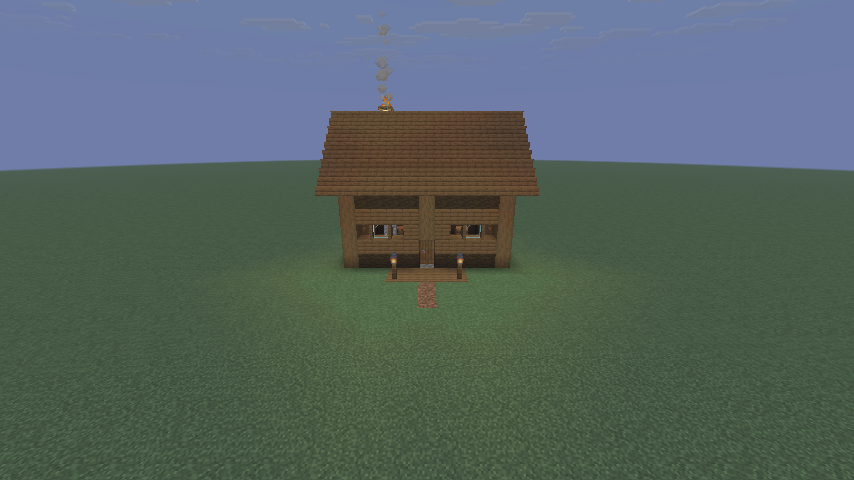
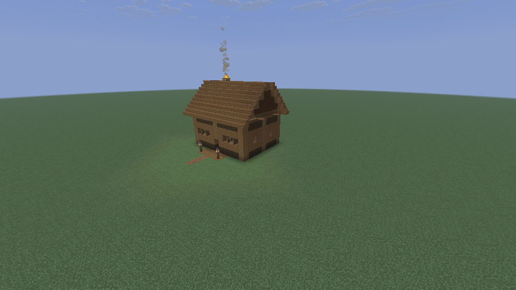
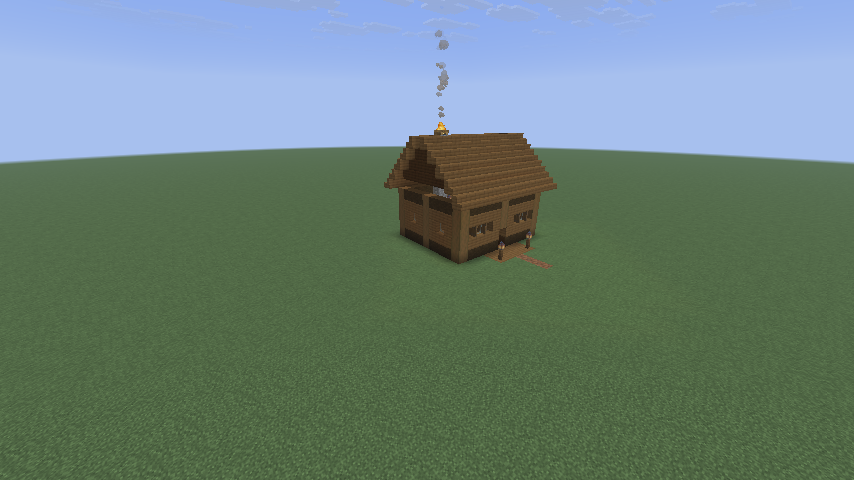

# MinecraftBuilder

**Remote Minecraft world editing, real client rendering, and evidence-driven iteration — from one Linux node.**

**在一台 Linux 节点上完成 Minecraft 世界编辑、真实客户端渲染与基于视觉证据的迭代。**

[English](#english) · [中文](#中文) · [Verified evidence / 验收证据](#verified-project--实测项目)



> A generated cabin captured by the remote HeadlessMC render worker. No local Minecraft GUI client was used.<br>
> 由远程 HeadlessMC 渲染工作进程拍摄的生成式 cabin；整个验收过程未启动本地 Minecraft 图形客户端。

## English

### Introduction

MinecraftBuilder is an experimental production stack for agents and procedural
tools that need to **edit a real Minecraft world, look at the result through a
real Minecraft client, and iterate from verifiable evidence**.

Instead of treating generation and screenshots as unrelated scripts, the
project connects them into one guarded loop:

```text
Plan / Generator
      ↓
Bounded edit through GDPC, WorldEdit, or custom generators
      ↓
Authoritative Fabric server
      ↓
HeadlessMC + Xvfb + real LWJGL/OpenGL rendering
      ↓
Visual Probe: camera pose → PNG + JSON metadata
      ↓
Readback, visual review, repair, and regression evidence
```

The current implementation targets researchers, agent builders, procedural
generation developers, and teams exploring remote Minecraft environment
production without depending on a user's desktop game client.

### Product highlights

- **One remote production loop.** Build, inspect, render, and evaluate on the
  server instead of asking a user to keep a graphical client open.
- **Multiple editing backends.** The accepted flow covers GDPC, a Python custom
  generator, and WorldEdit through a persistent real-player command session.
- **Real pixels, not a renderer stub.** HeadlessMC runs the actual Fabric client
  under Xvfb and Mesa llvmpipe. The HeadlessMC `-lwjgl` stub remains diagnostic
  only because it cannot produce valid acceptance PNGs.
- **Programmable observation.** Visual Probe accepts camera coordinates, yaw,
  pitch, FOV, chunk/stability requirements, and returns a PNG plus structured
  capture metadata.
- **Evidence before claims.** A build is checked by bounded writes, block
  readback, fixed camera views, requested-versus-actual pose comparison, and
  retained reports.
- **Reproducible operations.** Public-safe configuration, exact artifact
  checksums, bare-node bootstrap instructions, and cold/hot recovery procedures
  are versioned together.
- **Safety boundaries.** World-write readiness is separate from runtime
  readiness. Build areas, protected regions, pre-write inspection, rollback
  sources, and post-write QA remain explicit requirements.

### What has been verified

The current S0 acceptance was run on Ubuntu 24.04 with Minecraft 1.21.11,
Fabric Loader 0.19.5, Java 21, GDMC HTTP Interface 1.8.4, GDPC 8.1.0,
WorldEdit 7.4.2, HeadlessMC, Xvfb, Mesa llvmpipe, and Visual Probe.

| Capability | Verified result |
|---|---|
| Custom generation + GDPC write | 1,432 bounded operations; all structural anchors passed readback |
| WorldEdit bridge | One-block write and restoration passed through the persistent HMC player session |
| Real headless rendering | Three 854×480 daytime PNG captures passed |
| Camera control | Requested and actual position, yaw, pitch, and FOV matched within floating-point tolerance |
| Persistence | Structural anchors still passed after a server process exit and restart |
| Local GUI dependency | None during the accepted server-side workflow |

See the full [server cabin acceptance report](evidence/server-cabin/acceptance_report.md).

### Get started

#### 1. Clone the repository

```bash
git clone https://github.com/oliverlin-official/MinecraftBuilder.git
cd MinecraftBuilder
```

#### 2. Prepare an Ubuntu node

The verified baseline uses Ubuntu 24.04, Java 21, Python 3, GNU Screen, Xvfb,
XAuth, Mesa software OpenGL, a Fabric 1.21.11 server, and a matching Fabric
client profile.

Runtime JARs and Minecraft caches are intentionally not committed. Obtain the
exact tested artifacts listed in
[`manifests/runtime-artifacts.sha256`](manifests/runtime-artifacts.sha256), then
follow the [bare-node bootstrap runbook](<docs/Minecraft Server Node Bootstrap Runbook.md>).
The runbook includes an offline transfer route for servers that cannot reach
GitHub or other upstream hosts.

#### 3. Review and install the public configuration templates

The files under `config/` are public templates, not secrets. On a new node,
review them before installing:

```bash
install -Dm644 config/minecraft/server.properties \
  /home/ubuntu/server.properties
install -Dm600 config/headlessmc/config.properties \
  /home/ubuntu/headlessMC/HeadlessMC/config.properties
install -Dm644 config/gdmc/gdmc_http_interface.json \
  /home/ubuntu/config/gdmc_http_interface.json
install -Dm644 config/worldedit/worldedit.properties \
  /home/ubuntu/config/worldedit/worldedit.properties
install -Dm755 scripts/connect.bash \
  /home/ubuntu/headlessMC/connect.bash
```

Do not overwrite an existing deployment blindly. Back up and merge live
configuration first. Replace the example HeadlessMC offline player name and
UUID with a deployment-specific stable identity. Keep passwords, management
secrets, account files, and Visual Probe session tokens outside Git.

#### 4. Validate the render worker

After the launcher, client cache, and required client mods are installed:

```bash
cd /home/ubuntu/headlessMC
./connect.bash \
  --game-dir /home/ubuntu/headlessMC/srv/hmc-client/.minecraft \
  --server 127.0.0.1:59916 \
  --validate-only
```

Real rendering through Xvfb is the default. Do not use `--stub-renderer` for
screenshots.

#### 5. Start or recover the services

Follow the [operations runbook](<docs/Minecraft Server Agent Operations Runbook.md>)
instead of launching duplicate processes. It defines bare, cold, hot, partial,
and degraded states; the accepted startup order is:

```text
Minecraft/Fabric server → server readiness → HeadlessMC render worker → authenticated Probe READY
```

At minimum, verify the Screen sessions, owning processes, memory, and listeners:

```bash
screen -ls
ss -ltnp | awk 'NR == 1 || /:59916|:9000|:8766/'
curl -fsS --max-time 3 http://127.0.0.1:9000/version
```

#### 6. Capture a real client image

Visual Probe writes its loopback URL and short-lived bearer token to the local
client session file. The following example keeps the token in process memory
and prints only non-secret result fields:

```bash
python3 - <<'PY'
import json
import pathlib
import urllib.request

session_path = pathlib.Path(
    "/home/ubuntu/headlessMC/srv/hmc-client/.minecraft/visual-probe/session.json"
)
session = json.loads(session_path.read_text())
payload = {
    "observation_id": "README_DEMO",
    "pose": {
        "position": {"x": 185.5, "y": -1.0, "z": 27.5},
        "rotation": {"yaw": 180.0, "pitch": 18.0},
        "fov": 70,
    },
    "render_profile": "PRODUCTION",
    "required_chunk_radius": 2,
    "stable_ticks": 20,
}
request = urllib.request.Request(
    session["base_url"] + "/v1/observe",
    data=json.dumps(payload).encode(),
    headers={
        "Authorization": "Bearer " + session["token"],
        "Content-Type": "application/json",
    },
    method="POST",
)
with urllib.request.urlopen(request, timeout=90) as response:
    result = json.load(response)
print(json.dumps({
    "status": result.get("status"),
    "capture_id": result.get("capture_id"),
    "png_path": result.get("png_path"),
    "actual_pose": result.get("actual_pose"),
}, indent=2))
PY
```

#### 7. Run a safe edit experiment

Install the tested Python client in an isolated environment:

```bash
python3 -m venv .venv
. .venv/bin/activate
python -m pip install 'gdpc==8.1.0'
```

Before running `tools/server_cabin_acceptance.py`, create and verify the exact
GDMC build area, complete the pre-write scan, and provide the required rollback
snapshot. The tool intentionally refuses an unprepared transaction. Read the
[Environment Adapter](<docs/Minecraft Environment Adapter — SKILL.md>) before
any world mutation.

### Repository map

| Path | Purpose |
|---|---|
| `config/` | Sanitized Minecraft, HeadlessMC, GDMC, and WorldEdit templates |
| `scripts/connect.bash` | Linux HeadlessMC/Xvfb launcher and preflight validation |
| `mc-visual-probe/` | Fabric client-mod source for authenticated camera capture |
| `src/` and `tools/` | Custom generators and acceptance tooling |
| `projects/` | Project source, contracts, style rules, and stage state |
| `evidence/` | Curated PNGs, metadata, and acceptance reports |
| `docs/` | Architecture, bootstrap, operations, observation, and safety documents |
| `manifests/` | Tested runtime artifact names and SHA-256 checksums |

### Current maturity and limitations

MinecraftBuilder is an accepted experimental stack, not a finished hosted
service. Visual Probe V0.1 uses a spectator player as the camera backend, its
`world_revision` value is not yet a deterministic synchronization fence, and
software OpenGL can be slow. Resource-pack/shader orchestration, multi-worker
scheduling, and SaaS isolation remain future work.

For an offline-mode server, restrict the Minecraft port to approved source IPs.
Never expose GDMC port `9000` or Visual Probe port `8766` to the public Internet.

---

## 中文

### 项目介绍

MinecraftBuilder 是一套面向 Agent 与程序化生成工具的实验性生产系统。它关注的不是单独“生成建筑”或“截一张图”，而是让 Agent 能够在真实 Minecraft 环境中完成：

> **编辑世界 → 读取验证 → 从指定机位获得真实客户端画面 → 根据证据继续修正。**

系统将 Fabric 权威服务端、GDPC、WorldEdit、自定义生成器、HeadlessMC
渲染工作进程、Xvfb 以及 Visual Probe 连接为同一个受约束的生产闭环。
目标用户包括 Minecraft Agent 研发者、程序化生成研究者、自动化建造工具作者，
以及希望把 Minecraft 环境生产迁移到远程服务器的团队。

### 产品亮点

- **远程一体化生产。** 编辑、检查、渲染和验收都在服务器完成，不要求用户长期打开本地图形客户端。
- **多种编辑后端。** 已验收流程覆盖 GDPC、Python 自定义生成器，以及通过真实玩家持久会话执行的 WorldEdit。
- **真实像素，而非渲染桩。** HeadlessMC 在 Xvfb 与 Mesa llvmpipe 下运行真实 Fabric 客户端；`-lwjgl` stub 仅保留作诊断用途，因为它不能输出有效验收 PNG。
- **可编程观察。** Visual Probe 接受坐标、yaw、pitch、FOV、区块与稳定等待要求，并返回 PNG 与结构化元数据。
- **用证据闭环。** 写入范围、方块回读、固定机位、请求/实际姿态比对和验收报告共同构成结果证明。
- **可复现部署。** 仓库同时版本化公开安全配置、制品哈希、裸机初装文档，以及冷启动/热启动恢复流程。
- **明确的安全边界。** 运行时 READY 不等于允许修改世界；build area、保护区、写前扫描、回滚源和写后 QA 都必须显式成立。

### 已验证能力

当前 S0 验收环境为 Ubuntu 24.04、Minecraft 1.21.11、Fabric Loader
0.19.5、Java 21、GDMC HTTP Interface 1.8.4、GDPC 8.1.0、WorldEdit
7.4.2、HeadlessMC、Xvfb、Mesa llvmpipe 与 Visual Probe。

| 能力 | 已验证结果 |
|---|---|
| 自定义生成器与 GDPC 写入 | 1,432 次有界操作，所有结构锚点回读通过 |
| WorldEdit 桥接 | 通过 HMC 的真实玩家持久会话完成单方块写入与恢复 |
| 后台真实渲染 | 三张 854×480 日间 PNG 通过验收 |
| 指定机位 | 实际坐标、yaw、pitch 与 FOV 在浮点容差内匹配请求值 |
| 世界持久化 | 服务端进程退出并重启后，结构锚点仍全部通过 |
| 本地图形客户端依赖 | 已验收服务端流程中没有启动本地 GUI 客户端 |

完整数据见 [server cabin 验收报告](evidence/server-cabin/acceptance_report.md)。

### 快速开始

#### 1. 克隆仓库

```bash
git clone https://github.com/oliverlin-official/MinecraftBuilder.git
cd MinecraftBuilder
```

#### 2. 准备 Ubuntu 节点

已验证基线使用 Ubuntu 24.04、Java 21、Python 3、GNU Screen、Xvfb、
XAuth、Mesa 软件 OpenGL、Fabric 1.21.11 服务端和匹配的 Fabric 客户端。

仓库不会提交 Minecraft 缓存或运行时 JAR。请按照
[制品哈希清单](manifests/runtime-artifacts.sha256)准备对应版本，并遵循
[裸机初装文档](<docs/Minecraft Server Node Bootstrap Runbook.md>)。当服务器无法访问
GitHub 或其他上游站点时，该文档也提供离线转运方案。

#### 3. 检查并安装公开配置模板

`config/` 中的文件是经过脱敏的公开模板。只应在新节点上确认内容后安装：

```bash
install -Dm644 config/minecraft/server.properties \
  /home/ubuntu/server.properties
install -Dm600 config/headlessmc/config.properties \
  /home/ubuntu/headlessMC/HeadlessMC/config.properties
install -Dm644 config/gdmc/gdmc_http_interface.json \
  /home/ubuntu/config/gdmc_http_interface.json
install -Dm644 config/worldedit/worldedit.properties \
  /home/ubuntu/config/worldedit/worldedit.properties
install -Dm755 scripts/connect.bash \
  /home/ubuntu/headlessMC/connect.bash
```

不要直接覆盖已有部署。应先备份并合并现有配置，将示例 HeadlessMC 离线玩家名和
UUID 替换为部署专用的稳定身份。密码、管理密钥、账户文件和 Visual Probe
session token 都不得进入 Git。

#### 4. 验证渲染工作进程

安装 launcher、客户端缓存和所需客户端模组后执行：

```bash
cd /home/ubuntu/headlessMC
./connect.bash \
  --game-dir /home/ubuntu/headlessMC/srv/hmc-client/.minecraft \
  --server 127.0.0.1:59916 \
  --validate-only
```

脚本默认使用 Xvfb 下的真实渲染路径。截图时不要使用 `--stub-renderer`。

#### 5. 启动或恢复服务

按照 [日常运维文档](<docs/Minecraft Server Agent Operations Runbook.md>)判断当前是裸机、
冷启动、热启动、局部缺失还是降级状态，不要重复启动已有进程。已验收的启动顺序是：

```text
Minecraft/Fabric 服务端 → 服务端 READY → HeadlessMC 渲染工作进程 → 认证后的 Probe READY
```

最低限度检查：

```bash
screen -ls
ss -ltnp | awk 'NR == 1 || /:59916|:9000|:8766/'
curl -fsS --max-time 3 http://127.0.0.1:9000/version
```

#### 6. 获取真实客户端画面

上方英文步骤 6 提供了完整的安全调用示例：它从客户端本地 `session.json` 读取
loopback URL 与短期 bearer token，在内存中完成认证，然后向 `POST /v1/observe`
提交坐标、yaw、pitch 和 FOV。示例只打印截图路径与实际姿态，不输出 token。

#### 7. 运行安全编辑实验

先安装已验证的 GDPC 版本：

```bash
python3 -m venv .venv
. .venv/bin/activate
python -m pip install 'gdpc==8.1.0'
```

运行 `tools/server_cabin_acceptance.py` 之前，必须先建立并核对精确的 GDMC
build area，完成写前扫描，并提供所需回滚快照；工具会主动拒绝未准备好的事务。
任何世界修改都应先阅读
[Environment Adapter](<docs/Minecraft Environment Adapter — SKILL.md>)。

### 仓库结构

| 路径 | 用途 |
|---|---|
| `config/` | 脱敏后的 Minecraft、HeadlessMC、GDMC 与 WorldEdit 配置模板 |
| `scripts/connect.bash` | Linux HeadlessMC/Xvfb 启动器及依赖预检 |
| `mc-visual-probe/` | 提供认证机位截图的 Fabric 客户端模组源码 |
| `src/`、`tools/` | 自定义生成器与验收工具 |
| `projects/` | 项目源码、生产契约、风格规则和阶段状态 |
| `evidence/` | 精选 PNG、元数据和验收报告 |
| `docs/` | 架构、初装、运维、观察协议与写入安全文档 |
| `manifests/` | 已测试运行时制品名称和 SHA-256 哈希 |

### 当前成熟度与限制

MinecraftBuilder 是经过 S0 验收的实验性系统，还不是可直接商用的托管服务。
Visual Probe V0.1 使用 spectator player 作为机位后端，`world_revision` 尚未成为
确定性的同步屏障，软件 OpenGL 渲染速度也可能较慢。资源包/Shader 编排、
多 worker 调度与 SaaS 隔离仍属于后续路线。

如果必须使用离线模式，应只向获准来源 IP 开放 Minecraft 端口；GDMC `9000`
和 Visual Probe `8766` 绝不能暴露到公网。

---

## Verified project / 实测项目

The following images are direct outputs from the accepted remote pipeline, not
mockups or locally staged screenshots. / 以下图片均由已验收的远程流水线直接输出，
不是概念图，也不是在本地图形客户端中摆拍。

| Front / 正面 | Southeast / 东南视角 | Southwest / 西南视角 |
|---|---|---|
|  |  |  |

**Remote Server Cabin / 远程服务端 Cabin** — generated with the custom Python
grammar, written through GDPC inside a bounded transaction, structurally read
back, smoke-tested with WorldEdit, and captured from three requested poses by
the real headless client. / 由 Python 自定义语法生成，在有界事务中通过 GDPC 写入，
完成结构回读与 WorldEdit 冒烟测试后，再由真实后台客户端从三个指定机位截图。

## Security

- Tracked configuration contains public example identities and empty secret
  fields only. / 仓库配置只包含公开示例身份，所有密钥字段均为空。
- Do not commit worlds, account files, `session.json`, logs, deployed secrets,
  or downloaded runtime caches. / 不要提交世界、账户文件、`session.json`、日志、
  部署密钥或下载缓存。
- Treat `9000` as a command-capable control plane and keep it loopback-only or
  strictly firewalled. / `9000` 具备命令执行能力，必须限制在 loopback 或严格防火墙内。

## License

The Visual Probe module includes its own license in
[`mc-visual-probe/LICENSE`](mc-visual-probe/LICENSE). Other repository content
has no project-wide license yet; do not assume redistribution rights beyond
what an individual file states. / Visual Probe 模块包含独立许可证；仓库其他内容目前
尚无统一项目许可证，请勿假定未声明内容具备再分发授权。
